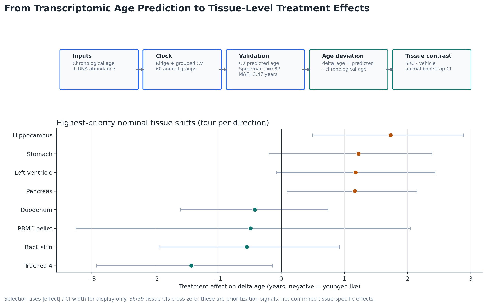
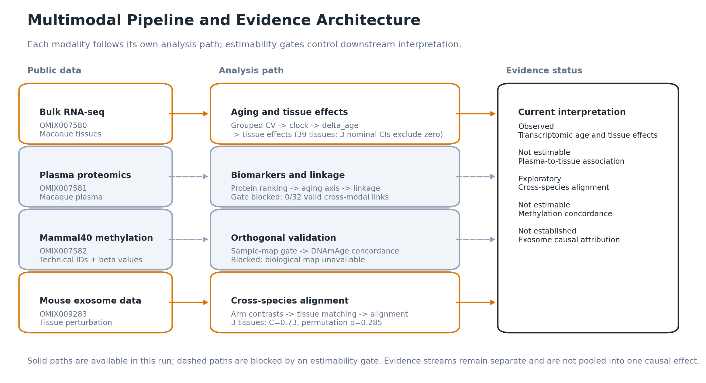
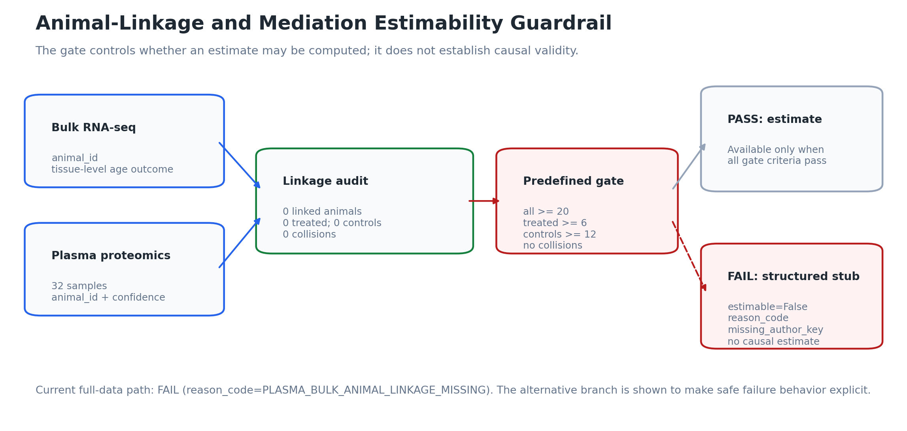

# OMIX Exosome Rejuvenation

**A reproducible primate multi-omics analysis of tissue-intrinsic and
plasma/exosome-associated aging signals.**

## What This Project Asks and Why It Matters

This project asks a focused but ambitious question:

> Do the rejuvenation-associated signals reported after senescence-resistant
> cell (SRC) treatment look more consistent with tissue-intrinsic change or with
> a plasma/exosome-associated mechanism?

Distinguishing these explanations matters because tissue-intrinsic change and
circulating carrier-associated activity imply different therapeutic targets,
biomarker strategies, and validation experiments. Public data can prioritize
these alternatives, but direct exosome causality would require recipient-level
exposure or cargo-transfer evidence that is not currently available.

The repository reanalyzes public OMIX transcriptomic, proteomic, methylation,
and supporting mouse data. It tests which biological questions the available
study design can answer, reporting uncertainty and keeping treatment responses
separate from evidence of a causal mechanism.

## Evidence at a Glance

This table separates analysis availability, design requirements, and the scientific
status of each claim after the September 2026 corrected full-profile rerun.
All numerical results shown here were regenerated under the current animal-level,
linkage, and cross-species contracts.

| Evidence layer | Question | Claim status | Current result |
|---|---|---|---|
| Transcriptomic age model | Does tissue expression predict chronological age? | **Observed** | Controls-only nested cross-fitting across 60 evaluation animals gives Spearman `r = 0.87` and animal-balanced MAE `= 3.47` years, with substantial age-range compression. |
| Tissue treatment effects | Do treated tissues show younger-like transcriptomic age? | **Observed, not statistically supported** | The global SRC-minus-vehicle estimate is slightly older-like (`+0.46` years; 95% CI `-0.76` to `1.61`); no tissue passes the primary family-wise correction. |
| Plasma proteomics | Is the circulating protein state associated with age or intervention? | **Exploratory** | The reference-trained protein axis shifts younger-like after SRC (`-1.69` axis units versus vehicle), but its interval crosses zero and the old-young reference gap is unstable. |
| Macaque methylation | Is there independent epigenetic evidence of rejuvenation? | **Not estimable** | The Mammal40 technical-to-biological sample map is unavailable. |
| Macaque-mouse exosome alignment | Are macaque tissue effects concordant with mouse exosome perturbations? | **Exploratory** | Three organ-compatible pairs give positive directional alignment (`C = 0.73`), but uncertainty is wide and the permutation test is not significant (`p = 0.285`). |
| Plasma-tissue mediation | Can a linked plasma state statistically mediate the transcriptomic response? | **Not estimable** | Naming alone no longer passes the identity gate; mediation is disabled pending confirmed cross-modal links. |
| Causal attribution | Did exosomes cause the macaque rejuvenation response? | **Not established** | The public design lacks direct exosome exposure or cargo-to-recipient outcome linkage. |

`Observed` means estimated, not necessarily statistically supported;
`Exploratory` means hypothesis-generating. `Supported` requires corroborating
evidence; no current mechanism-facing claim meets that threshold.
`Not estimable` denotes a missing design or data requirement; `Not established`
denotes a conclusion the analysis cannot justify. See the
[inference framework](docs/inference_framework.md) for the full definitions.

This reanalysis distinguishes transcriptomic age prediction from
treatment-response evidence. The corrected primary clock recovers
age-associated expression across held-out animals, but does not support robust
transcriptomic-clock rejuvenation after SRC treatment. Plasma and mouse
exosome data retain suggestive response signals that are biologically useful
for prioritization, while remaining too uncertain for a rejuvenation or causal
claim.

Across the three primary-compatible cross-species pairs, kidney and muscle are
directionally aligned while liver is discordant. The positive aggregate
alignment therefore motivates a more specific molecular question—what programs
are shared between macaque SRC treatment and mouse SRC-Exo perturbation?—but
does not estimate an exosome-attributable fraction or establish transfer to
macaques.

Read the full interpretation in [RESULTS.md](RESULTS.md).



*Figure 1. The controls-only clock is evaluated with animal-grouped nested
cross-fitting before estimating animal-level SRC-minus-vehicle shifts in
`delta_age`. Three of 39 pointwise intervals exclude zero, but none of the
tissue effects passes the primary family-wise correction; displayed tissues
are prioritization candidates, not confirmed rejuvenation effects.*

## Evidence Architecture

The workflow combines scientific analysis with explicit estimability controls:

- A grouped cross-validated transcriptomic aging clock and uncertainty-aware
  tissue summaries.
- Conservative plasma-to-animal linkage with collision, coverage, and
  confidence audits.
- Animal-level mediation that cannot run silently when linkage assumptions
  fail.
- Cross-species exosome-alignment analysis kept separate from direct primate
  mediation.
- Orthogonal validation modules that emit structured limitations instead of
  filling metadata gaps by positional inference.
- A report layer that converts machine-readable result tables into
  interpretation-facing figures without recomputing the analysis.

### Analysis Requirements and Estimability

| Analysis | Design requirement | Current status |
|---|---|---|
| Methylation validation | Biological sample identities | Not estimable: sample map unavailable |
| Macaque age and treatment effects | Animal-grouped prediction and within-tissue comparisons | Estimable, tissue effects uncertain |
| Plasma–tissue association | Confirmed shared animal identities | Not estimable: cross-modal identity remains unconfirmed |
| Cross-species alignment | Compatible tissues and treatment contrasts | Estimable for three organ-compatible pairs; alignment remains exploratory |
| Linked mediation | Linked biological units and causal identification assumptions | Not estimable with current public identity evidence |

This table describes analysis-specific requirements, not a hierarchy of
scientific certainty. An analysis being estimable does not establish effect
significance or causal interpretation.

## Data and Workflow

The primary datasets and supporting public resources are:

- `OMIX007580`: macaque bulk transcriptomics.
- `OMIX007581`: macaque plasma proteomics.
- `OMIX007582`: Mammal40 methylation, currently limited by the missing sample
  map.
- `OMIX009283`: mouse exosome-related mechanism support.
- `OMIX009654` and `OMIX009655`: candidate exosome proteomics and metabolomics,
  audited separately from recipient plasma and awaiting sample labels.
- `OMIX007583`, `OMIX007586`, and `OMIX009284`: targeted validation or audited
  supporting resources, not additional primary cohorts.

The [source audit](docs/data_refresh.md) documents additional public specimen
metadata, article-linked sequencing deposits, and the remaining identity gaps.

The analysis proceeds through auditable, gated stages:

```text
Public OMIX data
  -> metadata, group-label, and identity audits
  -> grouped transcriptomic aging clock
  -> tissue treatment-response summaries
  -> plasma linkage and oriented aging axis
  -> gated animal-level mediation

Mouse exosome perturbation -> cross-species alignment
Validation datasets        -> guarded orthogonal checks
Result CSVs                 -> interpretation-facing report figures
```



*Figure 2. Each modality follows a distinct analysis path before contributing
to interpretation. Estimability gates block unsupported transitions;
plasma-to-tissue identity and Mammal40 biological validation remain unresolved,
while within-plasma summaries remain available. The three-tissue mouse
alignment is exploratory cross-species evidence, not direct macaque validation.*

Group-label interpretation follows
[the canonical crosswalk](docs/group_label_crosswalk.md). A modality-by-modality
summary is available in the [dataset guide](docs/datasets.md). Raw inputs are
treated as immutable; derived tables and figures are written to `results/` and
`figures/`.

## Evidence and Claim Boundaries

A computable result is not necessarily scientifically estimable or biologically
established.

- **Linkage:** cross-modal animal identity must be supported by an explicit,
  auditable mapping. Unresolved plasma samples remain unresolved.
- **Estimability:** linkage-dependent analyses run only when predefined linkage
  and sample-size requirements are met.
- **Mediation:** animal-level mediation is treated as conditional evidence, not
  proof that plasma or exosomes caused rejuvenation.
- **Cross-species evidence:** mouse exosome perturbations can strengthen or
  challenge a mechanistic hypothesis, but they do not establish causality in
  macaques or humans.



*Figure 3. The refreshed identity audit retains 24 candidate aliases but no
confirmed cross-modal links. The gate therefore blocks animal-level mediation
and writes a structured non-estimable result. The alternative branch shows
the requirements for a future linked analysis.*

See the [scientific inference and estimability framework](docs/inference_framework.md)
for the complete claim rules.

## Reproduce the Analysis

The demo profile uses the reduced example data distributed with the public
repository:

```bash
conda env create -f environment.yml
conda activate srsc
python -m src.run_pipeline --profile demo --safe
```

Run the scientific guardrail tests with:

```bash
python -m pytest -q tests/test_scientific_guardrails.py
```

Run the full-data profile against an independently downloaded, read-only data
directory:

```bash
python -m src.run_pipeline --profile full --data-root /path/to/omix-data
python -m src.report_figures
```

The full OMIX datasets are not redistributed here. Demo and full runs share the
same entry point and output schemas, but reduced demo data may produce different
analysis availability. See the [reproducibility guide](docs/reproducibility.md)
for profiles, input requirements, and optional workflows.
Mediation is disabled by default; enabling it does not bypass the identity gate.

## Repository and Documentation

| Path | Purpose |
|---|---|
| `src/` | Analysis, audit, attribution, and reporting modules |
| `tests/` | Automated scientific guardrails and smoke tests |
| `data/PROCESSED/` | Reduced example inputs for the demo profile |
| `results/`, `figures/` | Generated machine-readable outputs and figures |
| `docs/` | Study context, evidence rules, dataset audits, reproducibility, and output reference |

Key reading paths:

- [Scientific results and interpretation](RESULTS.md)
- [Documentation index](docs/README.md)
- [Setup and reproducible execution](docs/reproducibility.md)
- [Output and figure reference](docs/outputs.md)

Questions, reproducibility problems, and metadata corrections can be reported
through [GitHub Issues](https://github.com/richard2049/Omix-exosome-rejuvenation/issues).

## Current Status and Next Milestone

The core multimodal workflow, scientific guardrails, public demo, and
interpretation-facing report layer are implemented. The corrected full-data
run does not support robust transcriptomic-clock rejuvenation, but it identifies
testable plasma-protein and cross-species response candidates while preserving
their uncertainty and mechanism boundaries.

The next scientific milestone is to obtain or independently validate the
author-side plasma-to-animal identity map and the missing macaque transcript
feature map. These resources would determine whether plasma and tissue data can
support individual-level association and whether macaque molecular programs
can enter gene-, pathway-, and target-level analysis. In parallel, the current
protein and compatible-tissue contrasts can prioritize hypotheses without
pretending to provide a measured exosome-attributable fraction.

## Citation and License

Please cite the repository using the metadata in [CITATION.cff](CITATION.cff).
The source code is distributed under the [MIT License](LICENSE).
